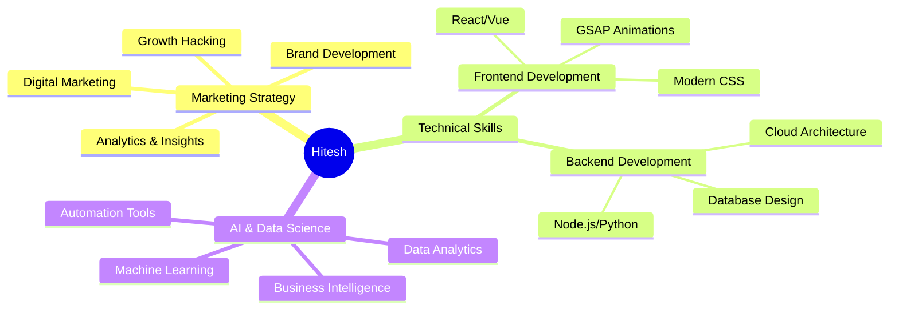

<div align="center">

# 👋 Hey there, I'm **Hitesh Sonawane**


</div>

---

<div align="center">

## 🚀 **About Me**

</div>

```yaml
name: Hitesh Sonawane
role: Chief Marketing Officer @ AgenticZone
location: India
current_focus: "Building AI-powered platforms that revolutionize business automation"
philosophy: "Mixing marketing + AI to make businesses smarter"
fun_fact: "I think I'm funny 😄 (and my code agrees!)"
```

<div align="center">

### 🎯 **What I'm Up To**

</div>

<table>
<tr>
<td width="50%">

**🔭 Currently Working On**
- [AgenticZone](https://agenticzone.shop/) – AI-powered integrated platform
- Website builder with smart automation
- Advanced CRM & e-commerce solutions
- AI-driven productivity tools

**🌱 Learning & Growing**
- Advanced React & Next.js ecosystem
- AWS & Cloud Infrastructure
- Marketing Analytics & Growth Hacking
- AI/ML integration strategies

</td>
<td width="50%">

**👯 Open to Collaborate**
- AI-driven platform development
- Marketing strategy & branding projects
- Open-source automation tools
- Business growth solutions

**🤝 Looking for Help With**
- Scaling AgenticZone infrastructure
- Building AI productivity communities
- Cloud automation strategies
- Advanced marketing analytics

</td>
</tr>
</table>

---

<div align="center">

## 🛠️ **Tech Arsenal**

</div>

<details>
<summary><b>🎨 Frontend Development</b></summary>
<br>
<p align="center">
  
</p>
</details>

<details>
<summary><b>⚡ Backend & Cloud</b></summary>
<br>
<p align="center">
  
</p>
</details>

<details>
<summary><b>🗄️ Database & Tools</b></summary>
<br>
<p align="center">
  
</p>
</details>

<details>
<summary><b>🤖 AI & Data Science</b></summary>
<br>
<p align="center">
  
  
  
</p>
</details>

---

<div align="center">

## 📊 **GitHub Analytics**

</div>

<div align="center">
  
  
</div>

<div align="center">
  
</div>

<div align="center">
  
</div>

---

<div align="center">

## 🏆 **Achievements & Trophies**


</div>

---

<div align="center">

## 🎯 **My Expertise**

</div>



---

<div align="center">

## 📝 **Latest Blog Posts**

[](https://medium.com/@hiteshsonawane988)

<!-- BLOG-POST-LIST:START -->
*Coming soon - Latest insights on AI, Marketing, and Tech!*
<!-- BLOG-POST-LIST:END -->

</div>

---

<div align="center">

## 🌐 **Let's Connect!**

<p>
<a href="https://linkedin.com/in/hitesh-sonawane" target="_blank">
  
</a>
<a href="https://instagram.com/hitesh_sonawane_official" target="_blank">
  
</a>
<a href="https://medium.com/@hiteshsonawane988" target="_blank">
  
</a>
<a href="https://www.leetcode.com/hitesh" target="_blank">
  
</a>
<a href="https://discord.gg/hitesh_sonawane_official" target="_blank">
  
</a>
<a href="mailto:hiteshsonawane988@gmail.com">
  
</a>
</p>

</div>

---

<div align="center">

### 💡 **"Innovation distinguishes between a leader and a follower."** 


</div>
